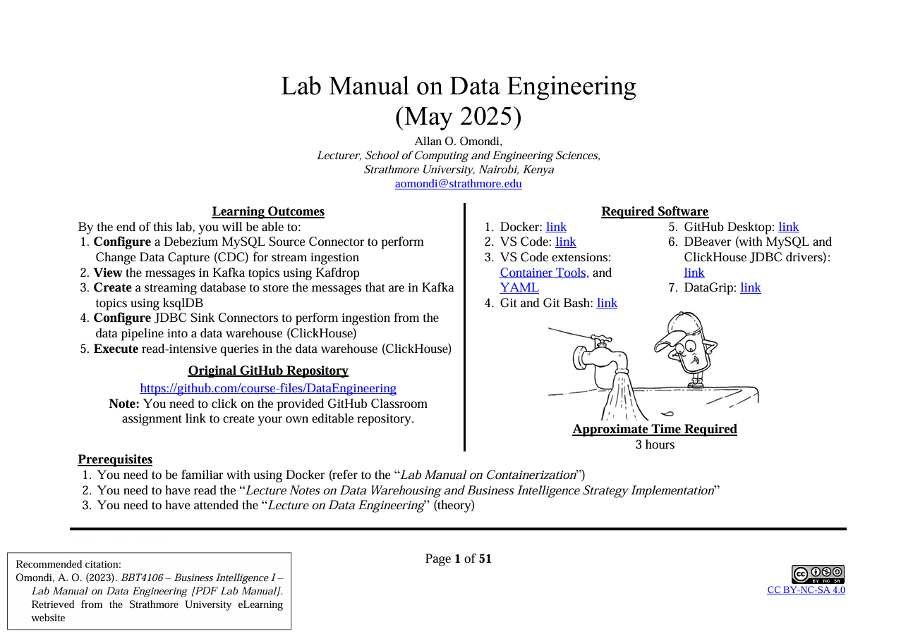
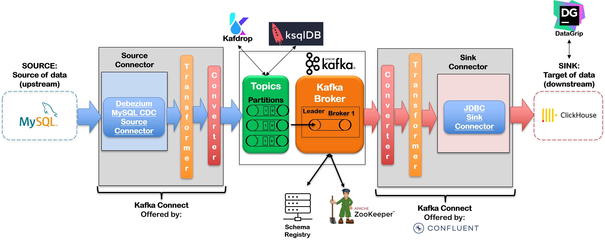

# [BBT4106] Lab 2: Data Engineering

| **Key**                                                               | Value                                                                                                                                                                              |
|---------------|---------------------------------------------------------|
| **Group Name**                                                       | ?                                                                                                                                                                            |
| **Semester Duration**                                                       | April 7th to July 11th 2025                                                                                                                                                           |
| **Submission**                                                       | [lab_submission.md](lab_submission.md)                                                                                                                                                           |

## Lab Manual

Please refer to the Lab Manual on Data Engineering for instructions.

## Lecture Notes

Please refer to the Lecture Notes on Data Engineering for the theoretical foundation.

## Technology Stack

_Apache®️, Apache Kafka, Kafka, the Kafka logo and other trademarks or logos are registered trademarks or logos. No endorsement by The Apache Software Foundation or other organizations is implied by the use of these trademarks or logos. This is meant for educational purposes only._
